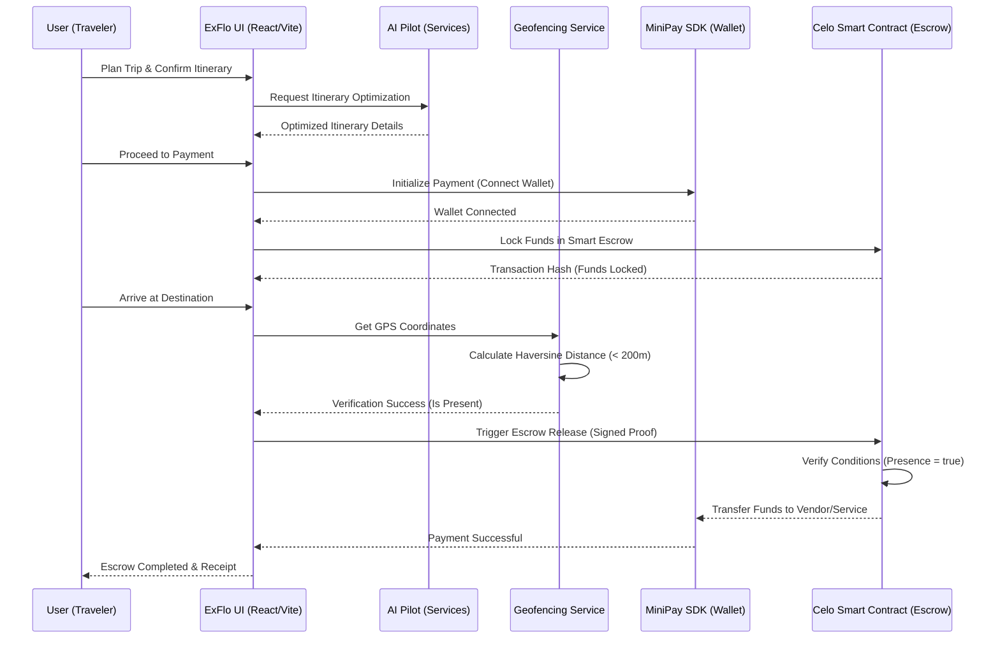

# ExFlo Architecture Diagram

This diagram illustrates the data flow between the AI Pilot, the MiniPay Wallet, and the Celo Smart Contract for the "Verification of Presence" and "Smart Escrow" modules.

